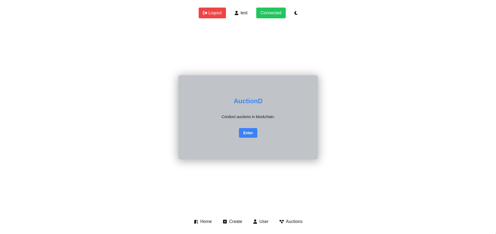
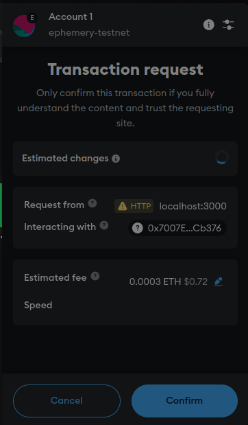
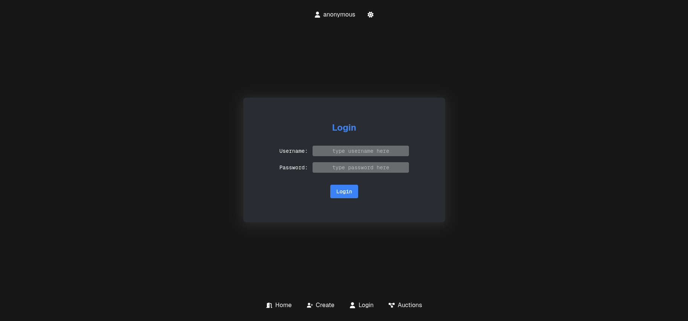
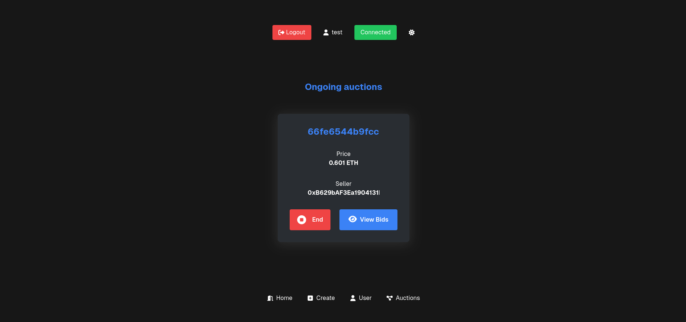
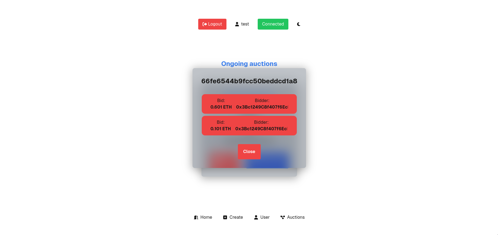
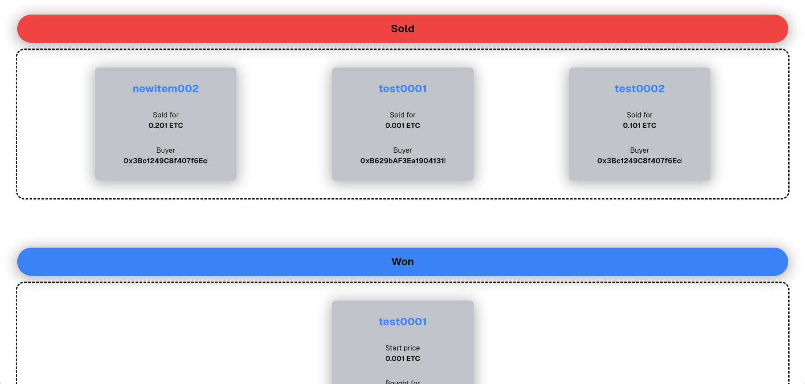

# AuctionD
Auction decentralised (a.k.a `AuctionD`) is a basic decentralised auction app (dApp) that utilises blockchain technology and allows users to create account, login, add items, auction them and bid for them in the blockchain.

Auctioned uses Mongo DB to store user and item details and uses websocket to dynamically update auction details.

## Features

- Create account

- Login and logout

- Add and delete items

- Start and end auctions

- View ongoing auctions

- Place and view bids

- View items that are sold or won by the user

- Light and Dark modes

## Requirements

- [Nodejs](https://nodejs.org/en) and [npm](https://nodejs.org/en) or [yarn](https://yarnpkg.com/) or [bun](https://bun.sh/) or [pnmp](https://pnpm.io/)

- [git](https://git-scm.com/)

- A web browser with [Metamask](https://metamask.io/) support `eg: Chrome, Firefox, etc,.`

- A Metamask wallet


## Getting Started

Clone the repo:

```bash
git clone https://github.com/pragathees8027/auction-dapp.git

cd auction-dapp
```

Install dependencies:

```bash
npm install
# or 
yarn install
# or
pnpm install
#or
bun install
```

Deploy the smart contract:

- Compile and deploy the Auction.sol (`./src/contract/Auction.sol`) in [Remix IDE](https://remix.ethereum.org/) using a testnet of your choice.

- Copy the the `ABI` and `contract address` from [Remix IDE](https://remix.ethereum.org/)

- Create a .env.local file (`./.env.local`)
    ```bash
    #.env.local

    # your deployed contract's address
    NEXT_PUBLIC_CONTRACT_ADDRESS='0x597B9...........' 

    # your compiled contract's abi
    NEXT_PUBLIC_AUCTION_ABI='[
	{
		"inputs": [],
		"stateMutability": "payable",
		"type": "constructor"
	},{
    }, 
    .......]'
    ```

Run the web-socket:

```bash
npm run server
# or
yarn server
# or
pnpm server
# or
bun server
```


Run the development server:

```bash
npm run dev
# or
yarn dev
# or
pnpm dev
# or
bun dev
```

Open [http://localhost:3000](http://localhost:3000) with your browser to see the result.

## AuctionD in action
<div style="display: grid; grid-template-columns: repeat(3, 1fr); gap: 16px;">
    <div style="grid-column: span 2;">
        
    </div>
    <div style="grid-row: span 3;">
        
    </div>
    <div style="grid-row: span 2;">
        
        
    </div>
    <div style="grid-row: span 3;">
        
        
    </div>
</div>


## Note
The project was built and tested on [`ephemery-testnet`](https://ephemery.dev/).
But it should work on other testnets.

Clicking on `Enter` button in homepage will log you out. That is intentional.
